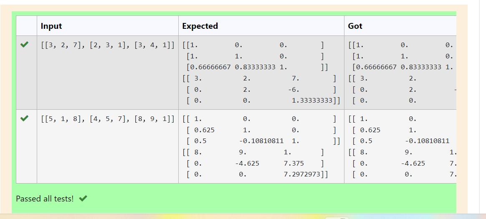
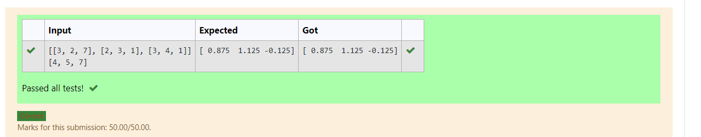

# LU Decomposition 

## AIM:
To write a program to find the LU Decomposition of a matrix.

## Equipments Required:
1. Hardware – PCs
2. Anaconda – Python 3.7 Installation / Moodle-Code Runner

## Algorithm
1.Import numpy and scipy.linalg

2.Take the input as given matrix using eval 

3.Calculate the values using the functions imported

4.Print the required values 

## Program:
```
Program to find L and U matrix using LU decomposition.
Developed by:Vivek Reddy 
RegisterNumber:21004190 
'''

import numpy as np
import scipy
from scipy.linalg import lu
A =eval(input())
P,L,U=lu(A)
print(L)
print(U)
```
```# To print X matrix (solution to the equations)
import numpy as np
from scipy.linalg import lu_factor,lu_solve
A =eval(input())
B =eval(input())
lu,piv= lu_factor(A)
x= lu_solve((lu,piv),B)
print(x)
```

## Output:




## Result:
Thus the program to find the LU Decomposition of a matrix is written and verified using python programming.

